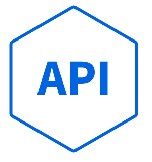

<p align="center"><a href="https://laravel.com" target="_blank"></a></p>


# Number to Words Converter 

The application provides conversion from a number to words, what is sometimes required for invoices, contracts etc. It currently supports numbers from one to Nonillion plus two digits after separation point (optionally).

Front-end for this app is provided at [https://github.com/conv-front-end](https://github.com/wie1900/conv-front-end)

## Usage
The endpoint `/api/conv/words` takes a number (`['number']`) as a string and returns it converted to words in JSON-format (`['words']`).

## Architecture
### Laravel quasi-module
The converter is configured as separated Laravel module under `/src/conv` folder. Its entrypoint service provider `ConvServiceProvider` is registered in the application `AppServiceProvider` and the routes config file _`routes_api.php`_ in the application `RouteServiceProvider`.

Finally, the name `Conv` has been added to namespaces and paths under 'psr-4' in _`composer.json`_.

### Hexagonal architecture
Further, it is Hexagonal-structured:
- `App` - for controllers requiring access to the application
- `Domain` - domain services and interfaces (primary/secondary ports, here `PortsIn` and `PortsOut`)
- `Infra` - implementations of secondary ports (secondary adapters)
```
src
|
+---conv
|   |
|   +---App
|   |   +---Controllers
|   |   +---Requests
|   |   |
|   +---Domain
|   |   +---PortsIn
|   |   +---PortsOut
|   |   +---Services
|   |   |
|   +---Infra
|   |   +---Converter
|
```

The controllers (App) use injected interfaces (primary ports, here `PortsIn`) of the domain and so they are decoupled from the domain specific services.
Likewise, the domain services use only interfaces (secondary ports, here `PortsOut`) and know nothing about their implementations (secondary adapters, here folder `Infra`).

All dependencies are provided by module entrypoint provider `ConvServiceProvider`, which contains bindings interfaces -> specific classes.

## What was used
- Laravel 10
- PHP 8.2

## Working version
The working version is used by front-end app at:<br/>
[https://app.deadygo.com/conv](https://app.deadygo.com/conv)
